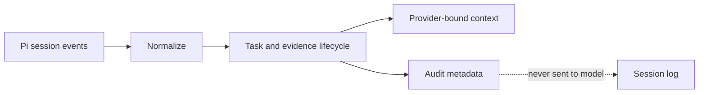

# agent-context-card

**Keep coding agents focused as sessions grow.**

agent-context-card is a passive context-projection extension for Pi. It keeps exact evidence while it is useful, retires it when observable lifecycle events make it replaceable, and prevents unrelated tasks from inheriting old context.

> **Measured result:** 58.3% fewer provider input tokens in a four-turn Gemma A/B run, with 25% fewer tool calls and zero tool errors in the card-enabled session.
>
> **Two SWE-bench Verified pilots:** on sympy__sympy-18211, the card resolved
> the task with 79.0% fewer provider-input tokens while the baseline was
> unresolved. On sympy__sympy-21930, both were unresolved, but the card passed
> 5/6 FAIL_TO_PASS tests versus 0/6 for the baseline with 73.8% fewer input
> tokens. Two tasks are not a pass-rate estimate.

## Why use it?

Long coding sessions repeatedly send old searches, file reads, tool output, and completed work back to the model. This increases input usage and can eventually trigger lossy compaction.

Common alternatives introduce their own tradeoffs:

- summaries can drop exact implementation details;
- semantic memory asks the agent to notice and retrieve missing evidence;
- fixed limits ignore task complexity;
- model-maintained memory turns bookkeeping into another task.

agent-context-card takes a different approach:

- **No extra model calls.** Projection is deterministic and local.
- **No memory tools.** The agent keeps working with its normal tools.
- **Exact active evidence.** Useful file reads remain verbatim.
- **No arbitrary character cap.** Context follows task complexity.
- **Inspectable decisions.** Retirement metrics stay outside model context.
- **Automatic task isolation.** Unrelated work starts with a clean task scope.
- **Experimental task continuity.** Exact ticket IDs can resume plans and
  historical execution facts across Pi sessions without carrying stale reads.

## Install

Install the npm package through Pi:

    pi install npm:agent-context-card

Then start Pi normally. The extension works without configuration.

Try it for one run without installing:

    pi -e npm:agent-context-card

For a controlled extension-only test:

    pi --no-extensions -e npm:agent-context-card

Until the first npm release is published, install directly from GitHub:

    pi install git:github.com/chkrishna2001/Agent-Context-Card

Project home: [github.com/chkrishna2001/Agent-Context-Card](https://github.com/chkrishna2001/Agent-Context-Card)

## What changes in the model context?

| Kept while useful                             | Retired when consumed                         |
| --------------------------------------------- | --------------------------------------------- |
| Current task, latest request, and pinned plan | Superseded directory listings and searches    |
| Exact active file-read output                 | Exact duplicate tool rounds                   |
| Valid tool-call/tool-result pairs             | Intermediate history from completed turns     |
| Unresolved failures                           | Pre-edit file versions after a grace boundary |
| Verified changes and validations              | Context from an unrelated prior task          |

The model receives a small derived card plus the projected live transcript. It is never asked to update or restate the card.

Cross-session continuity is opt-in through an exact task ID such as `JIRA-123`
or `django__django-12345`. A planning request captures the agent's exact final
plan automatically; continuing the same task promotes it into the card. Stored
execution facts are labeled as prior-session facts, and file-read evidence is
never resumed. State is kept under `.agent-context-card/tasks/` and
`/card-reset` removes the active task's stored snapshot.



## Evidence so far

The same four-turn coding workload was run with no extensions and with only agent-context-card.

| Metric                | No extension | agent-context-card |     Change |
| --------------------- | -----------: | -----------------: | ---------: |
| Provider input tokens |      153,360 |             63,883 | **-58.3%** |
| Provider requests     |           20 |                 16 |       -20% |
| Tool calls            |           16 |                 12 |       -25% |
| Tool errors           |            2 |                  0 |      -100% |
| Duration              |     2.22 min |           1.65 min |     -25.7% |

The implementation turn retained essentially the same amount of evidence. Across the later documentation, validation, and unrelated-task turns, input usage fell by **84.1%**.

This is a research preview, not a universal performance claim. Read the [design history, full protocol, per-turn data, limitations, and release gates](docs/design-and-evaluation.md).

### Automated cross-session evaluation

Run the isolated Pi baseline/card smoke test with:

    bun run eval:pi

A checked-in ten-session mixed gate adds planning, implementation, validation,
documentation, review, and unrelated-task boundaries:

    bun run eval:pi:ten-turn

It grades a real failing test, verifies workspace hashes and continuity
invariants, and captures provider, tool, timing, session, projection, and task
state metrics. The finalized live run preserved correctness while reducing
provider input by 11.2%, requests by 18.8%, and tool calls by 25.0%; duration was
effectively flat at 1.0% slower. See the [automated protocol and full result](docs/automated-multisession-evaluation.md).

The ten-session mixed gate also passed on both sides with the
`ai-inference-router/mycoder` route. The card used 29.2% fewer provider
requests, 34.2% fewer tool calls, had zero versus four tool errors, and completed
17.5% faster. The router did not report token usage, so no token comparison is
claimed for this run.

The first `openai/gpt-5-nano` pair passed on both sides: the card used 58.6%
less provider input, 50.4% fewer total tokens, 31.3% fewer requests, and 38.2%
fewer tool calls. Trace analysis later classified four of its five raw repeated
signatures as valid post-edit rereads or revalidation; same-state repeats were
zero for baseline and one for the card.

Across three pooled Nano pairs, median card changes were -23.9% provider input,
-29.1% requests, -33.3% tools, and -0.4% duration. Ranges were wide: provider
input varied from -58.6% to +5.1%, while output and reported reasoning rose in
every pair. Baseline correctness was 3/3 and card correctness was 2/3. The failed
card run passed production tests and continuity checks but returned a plan
instead of making the required README edit. This possible stale-plan-dominance
failure is now an explicit experiment target, not hidden negative evidence.

### Official SWE-bench Verified pilots

| Task               | Baseline   | Context card | Card input change | Card tool change |
| ------------------ | ---------- | ------------ | ----------------: | ---------------: |
| sympy__sympy-18211 | unresolved | resolved     |            -79.0% |           -66.0% |
| sympy__sympy-21930 | unresolved | unresolved   |            -73.8% |           -50.0% |

For the second task, the card passed 5/6 FAIL_TO_PASS tests while the baseline
passed 0/6; both preserved all 45 PASS_TO_PASS tests. This is useful negative
evidence, not a card resolution. Exact counts, timings, excluded interrupted
runs, and article-ready raw metrics are kept in the checked-in
[evidence ledger](evaluation/results/evidence-ledger.json).

## Commands and configuration

| Command                | Purpose                            |
| ---------------------- | ---------------------------------- |
| /card                  | Show the current derived card      |
| /card-new &lt;goal&gt; | Start an explicit task             |
| /card-reset            | Clear and close the active task    |
| /card-stats            | Show the latest projection metrics |

| Flag                                  | Default | Purpose                                   |
| ------------------------------------- | ------: | ----------------------------------------- |
| --context-card-recent-turns &lt;n&gt; |       2 | Recent user turns eligible for projection |
| --context-card-audit on\|off          |      on | Persist non-content projection telemetry  |

The adapter registers zero model-facing tools.

## For researchers

The projection engine is platform-neutral and available as an experimental package export:

```ts
import {
  projectContext,
  type ContextMessage,
  type ProjectionResult,
} from "agent-context-card/core";
```

Normalize a host transcript into ContextMessage values, call projectContext, and translate the returned raw messages through the host's provider-context hook.

Pi is the reference adapter because it can directly replace provider-bound context. Claude Code, Codex, Cursor, and Antigravity require separate capability audits; adding instructions alone cannot produce equivalent savings.

## Safety and privacy

Projection runs locally and makes no additional provider requests. Pi still sends model-visible prompts, file contents, and tool results to the model provider selected by the user. Review provider data policies before using any coding agent with private source code.

## Development

Requires Node.js 22.19+ and Bun for repository development.

    bun install
    bun test
    bun x tsc --noEmit
    bun x eslint .
    bun x prettier --check .
    bun build index.ts --outdir dist --target node

Current validation: 30 focused tests, strict type checking, linting, formatting, and production bundling.

## Releases

Releases are published to npm only from version tags after CI and changelog validation. See [CHANGELOG.md](CHANGELOG.md) for release notes and [AGENTS.md](AGENTS.md) for the maintainer procedure.

## Status

**Research preview.** The evidence is a strong proof of concept. Repeated
broader-repository runs and live fork/interruption/tree-navigation gates remain
before a production-ready claim.

Licensed under MIT.
